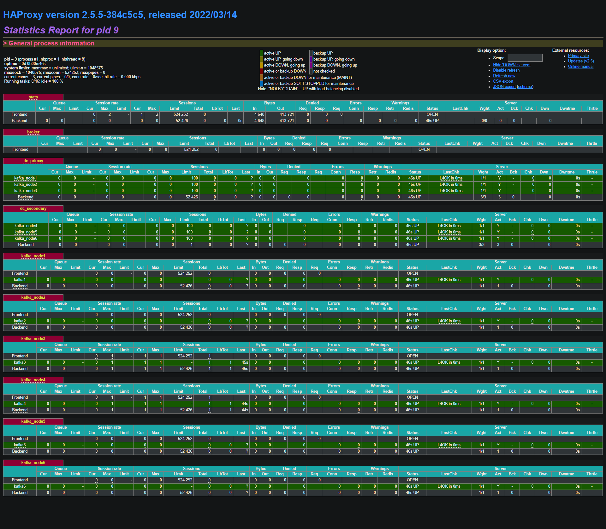
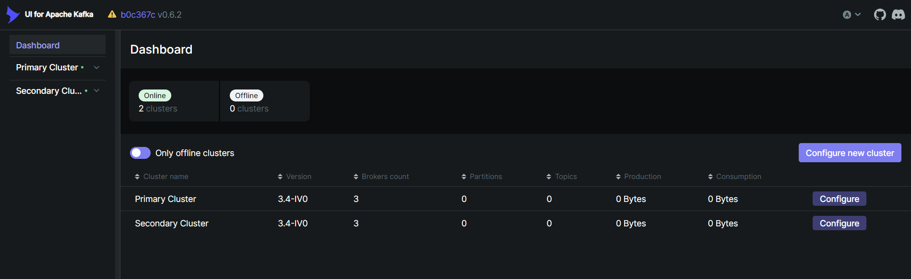

# Running a Multi-Broker Kafka Cluster on Docker

## Launch Kafka
```sh
make up
make ps # view process
```

output
```
$ make ps
docker-compose -f "./docker-compose-haproxy.yml" ps
  Name                Command               State                                         Ports
--------------------------------------------------------------------------------------------------------------------------------------
haproxy    docker-entrypoint.sh hapro ...   Up      0.0.0.0:1936->1936/tcp,:::1936->1936/tcp,
                                                    0.0.0.0:9092->9092/tcp,:::9092->9092/tcp, 0.0.0.0:9093->9093/tcp,:::9093->9093/tcp
kafka-ui   /bin/sh -c java --add-open ...   Up      0.0.0.0:9000->8080/tcp,:::9000->8080/tcp
docker-compose -f "./kafka_cluster1/docker-compose.yml" ps
  Name               Command                    State                      Ports
--------------------------------------------------------------------------------------------
kafka1      /etc/confluent/docker/run   Up (health: starting)   9092/tcp
kafka2      /etc/confluent/docker/run   Up (health: starting)   9092/tcp
kafka3      /etc/confluent/docker/run   Up (health: starting)   9092/tcp
zookeeper   /etc/confluent/docker/run   Up (health: starting)   2181/tcp, 2888/tcp, 3888/tcp
docker-compose -f "./kafka_cluster2/docker-compose.yml" ps
    Name                 Command                    State                      Ports
------------------------------------------------------------------------------------------------
kafka4          /etc/confluent/docker/run   Up (health: starting)   9092/tcp
kafka5          /etc/confluent/docker/run   Up (health: starting)   9092/tcp
kafka6          /etc/confluent/docker/run   Up (health: starting)   9092/tcp
zookeeper_dc2   /etc/confluent/docker/run   Up (health: starting)   2181/tcp, 2888/tcp, 3888/tcp
```

## Go to HAProxy stat
http://localhost:1936



- Frontend section defines the IP addresses and ports that clients can connect to. Port 9092 is Kafka Broker 

* DC Primary(dc_primay)
    * kafka_node1
    * kafka_node2
    * kafka_node3

* DC Secondary(dc_secondary)
    * kafka_node4
    * kafka_node5
    * kafka_node6

## Go to UI for Apache Kafka

http://localhost:9000

You can view two Kafka clusters in the dashboard menu.




## Testing with Producers and Consumers
The producer generates random data and sends it to a topic, where the consumer will listen on the same topic and read messages from that topic.

To view the output of what the producer is doing, you can tail the logs:

```sh
cd client
docker-compose up -d
```

OUTPUT(do not copy)
```js
$ docker-compose ps
  Name            Command           State   Ports
-------------------------------------------------
consumer   sh /src/run.sh $ACTION   Up
producer   sh /src/run.sh $ACTION   Up
```

View logs prodecure
```sh
docker logs -f producer
```
OUTPUT(do not copy)
```js
starting producer
BOOTSTRAP_SERVERS=haproxy:9092
+ python3 /src/produce.py
setting up producer, checking if brokers are available
brokers not available yet
brokers are available and ready to produce messages
message sent to kafka with squence id of 1
message sent to kafka with squence id of 2
message sent to kafka with squence id of 3
message sent to kafka with squence id of 4
message sent to kafka with squence id of 5
```

View logs consumer
```sh
docker logs -f consumer
```

OUTPUT(do not copy)
```js
'sequence_id': 144, 'user_id': '47579', 'transaction_id': '443bc8ec-b7b3-4bd3-9707-4f572023e322', 'product_id': '60817', 'address': '2345 Allen Expressway | Youngborough | CZ', 'signup_at': '2024-06-06 13:57:48', 'platform_id': 'Tablet', 'message': 'transaction made by userid 175017981483345'}
{'sequence_id': 145, 'user_id': '39612', 'transaction_id': '947eb029-77e7-4937-8ffb-6ff78dccc370', 'product_id': '67226', 'address': '648 Wright Valley Apt. 346 | Huertamouth | SA', 'signup_at': '2024-06-10 12:43:48', 'platform_id': 'Tablet', 'message': 'transaction made by userid 149433651762485'}
{'sequence_id': 146, 'user_id': '98265', 'transaction_id': '6ebd9842-8326-42a2-bca6-e695f9edddde', 'product_id': '14230', 'address': '84384 Gomez Heights Apt. 801 | Lake Michaelland | AD', 'signup_at': '2024-06-13 09:29:41', 'platform_id': 'Mobile', 'message': 'transaction made by userid 260925315088781'}
{'sequence_id': 147, 'user_id': '97151', 'transaction_id': 'a1609cb2-6bc4-4d1d-a092-43508d160042', 'product_id': '94119', 'address': '3151 Matthew Point | Franciscohaven | PY', 'signup_at': '2024-06-05 18:34:29', 'platform_id': 'Tablet', 'message': 'transaction made by userid 38038633893952'}
```

Stop Producer & Consumer
```sh
docker-compose down
```

## Clean
```
make clean
```


# Test connection
docker exec -it --user root haproxy sh -c "apk add curl"
docker exec -it haproxy sh -c "nslookup kafka1 && nslookup kafka2 && nslookup kafka3"
docker exec -it haproxy sh -c "curl -v telnet://kafka1:9092"
docker exec -it haproxy sh -c "curl -v telnet://kafka2:9092"
docker exec -it haproxy sh -c "curl -v telnet://kafka3:9092"

docker restart haproxy

docker logs zookeeper
docker logs kafka1
docker logs -f kafka2
docker logs -f kafka3
docker logs haproxy


go to http://localhost:9000


